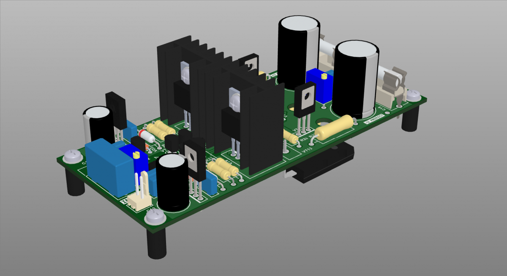

## Super A class amplifier Laikov v7

### Links
- [https://forum.cxem.net/index.php?/forum/120-усилитель-мощности-а-лайкова/](https://forum.cxem.net/index.php?/forum/120-усилитель-мощности-а-лайкова/)
- [https://forum.cxem.net/index.php?/topic/140725-коллективный-заказ-промышленных-плат-v7/](https://forum.cxem.net/index.php?/topic/140725-коллективный-заказ-промышленных-плат-v7/)

### Authors
- Shematic design - [Alex Laikov](https://forum.cxem.net/index.php?/profile/19707-19707-александр-л/)
- PCB design - [aitras](https://forum.cxem.net/index.php?/profile/79750-aitras/)

### Buy parts for assembling
- [Order PCB from PCBWay](https://www.pcbway.com/project/shareproject/Amplifier_Laikov_V7.html)

### Related projects
- [Power supply for amplifier Laikov v7](https://github.com/diyaudioby/ps-laikov-v7)
- [Speaker protection for amplifier Laikov v7](https://github.com/diyaudioby/sp-laikov-v7)

### Folder structure
Most folder names are self explanatory.
- 3d - contains 3d models of PCB
- bom - contains the bill of materials
- docs - contains drawings and images outputs of schematic and PCB files, assembling manuals
- firmware - contains compiled binary files
- gerbers - contains zip file of the PCB Gerbers and drill drawings for manufacture
- images - contain photo of assembling prototype
- pcb - contains the original schematic and PCB design files (Altium Designer,  KiCAD, SprintLayout, etc)
- soft - contains custom software using, for example, for operate with this device 
- source - contains project souce code (sketchs for Arduino, files C/C++, etc)
- transformers - contains spec for transformers, coils, etc